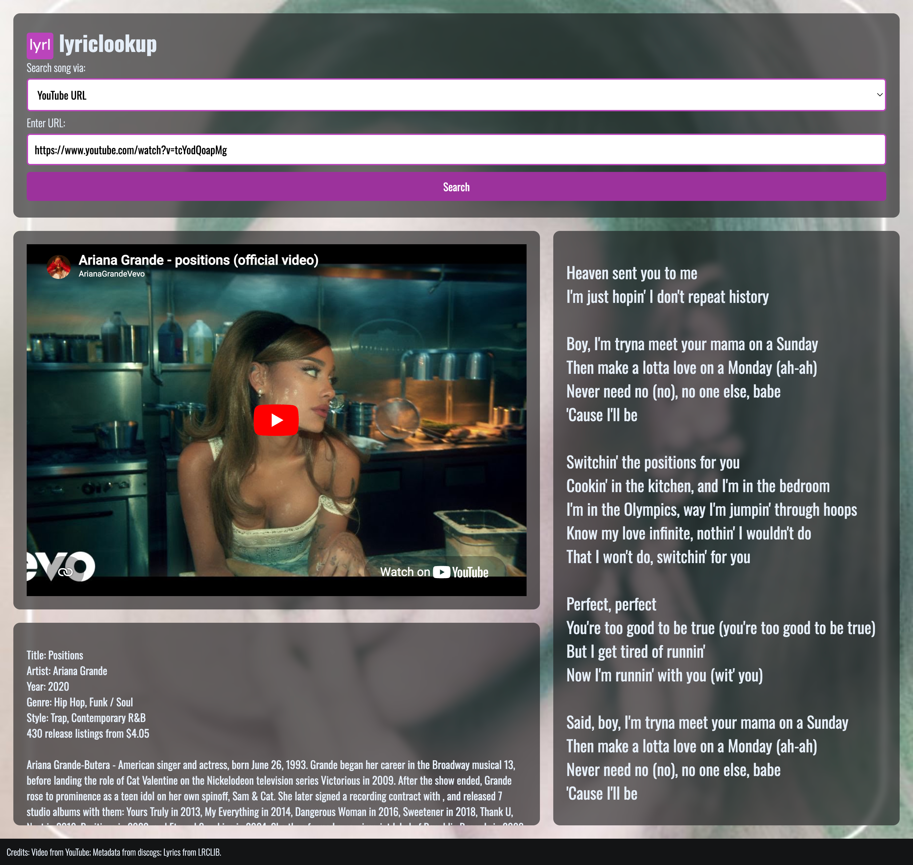
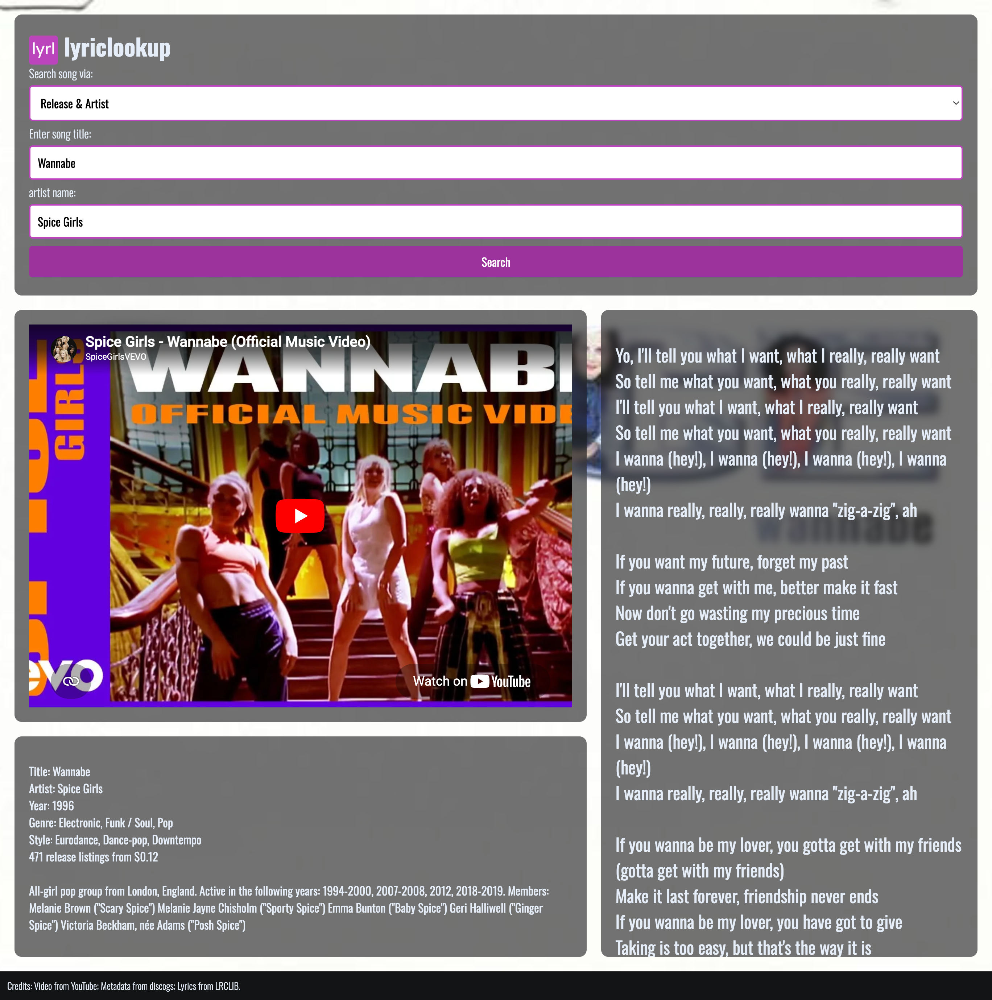
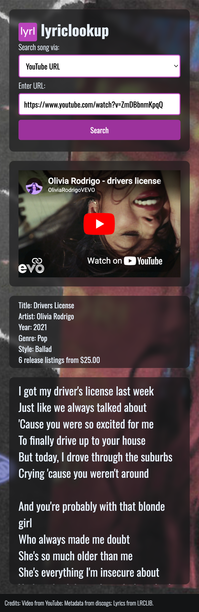
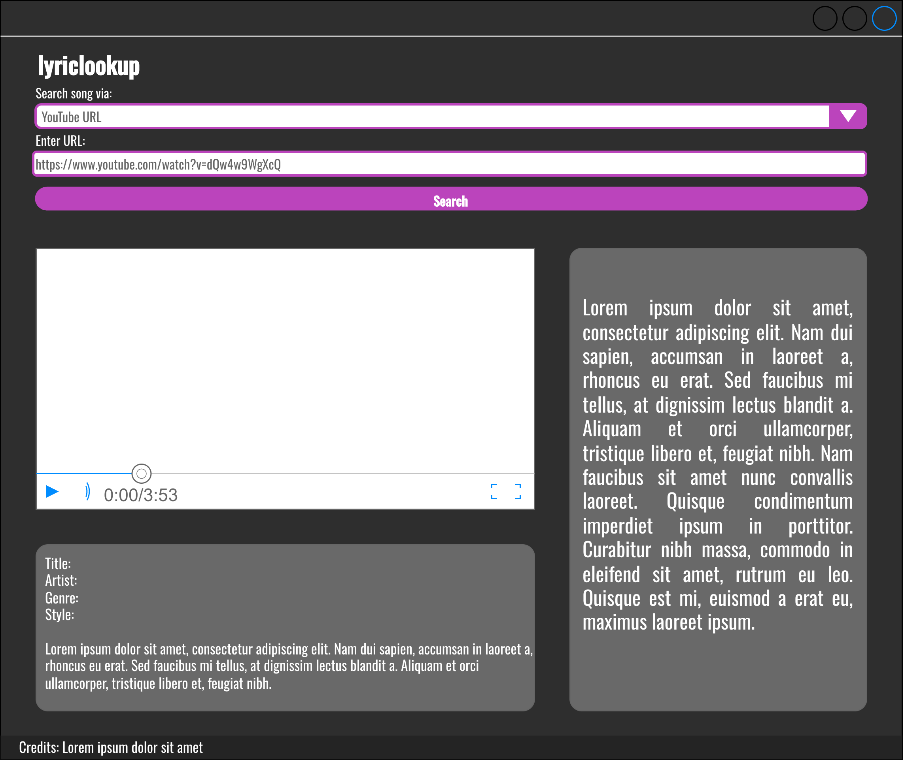
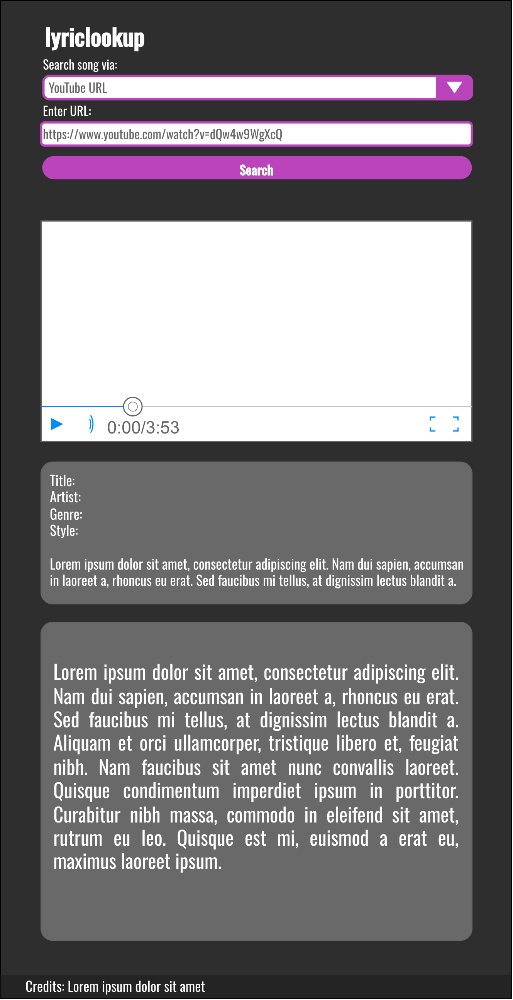

# [lyriclookup](https://miket-one.github.io/lyriclookup/)

A fast and responsive website for searching and viewing song lyrics.

## Features

- **Search**: Find lyrics via YouTube link or release title and artist name
- **Clean interface**: Lyric display conveniently displayed next to video
- **Discography**: Song and artist information
- **Release media**: Sales of release media with price information

## Screenshots

### Search via:

| URL | Release & Artist |
| :---: | :---: |
|  | |

### Mobile

## Design

The website uses a minimalist theme with a focus on readability. 

### Layout

The page is designed with the intention of showing important details to the user, while keeping an overall pleasant user experience.

The video content, lyrics, and metadata are arranged to fit the user's device viewport (100vh). Flexible layout that adapts to different screen sizes using flexbox.

### Wireframe

Click to expand

| Desktop | Mobile |
| :---: | :---: |
|  |  |  

## Acknowledgments

- [YouTube](https://youtube.com/)
- [Noembed](https://noembed.com/)
- [LRCLIB](https://lrclib.net/) - Crowdsourced lyrics
- [Discogs](https://www.discogs.com/developers/) - Database about audio recordings